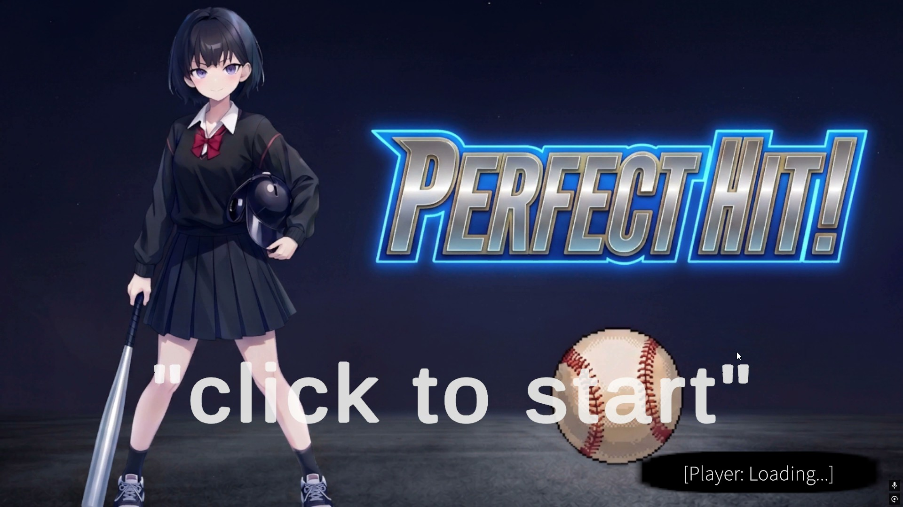
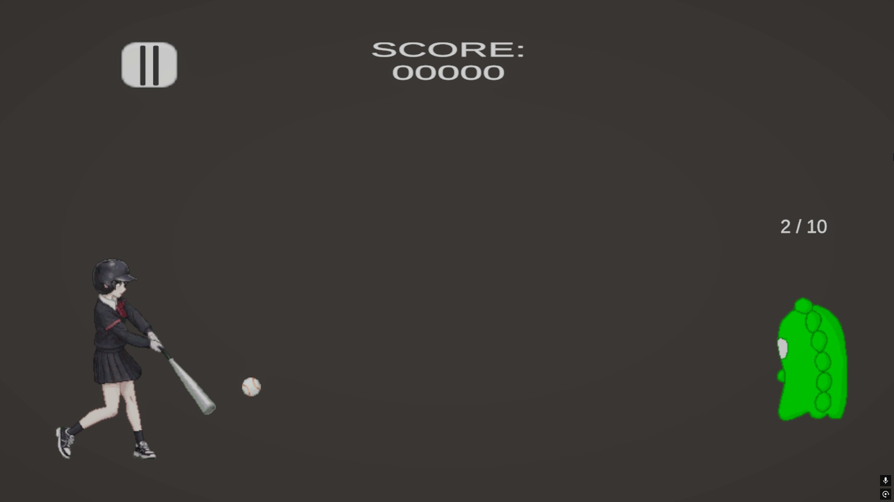
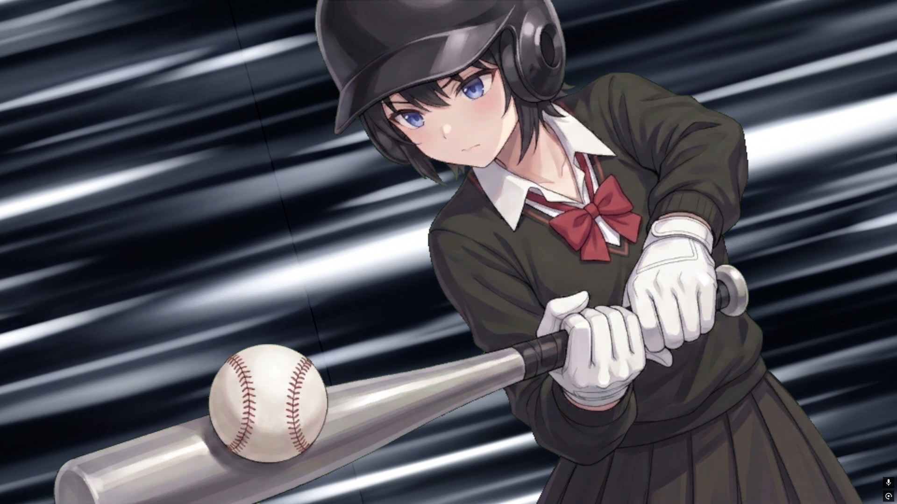
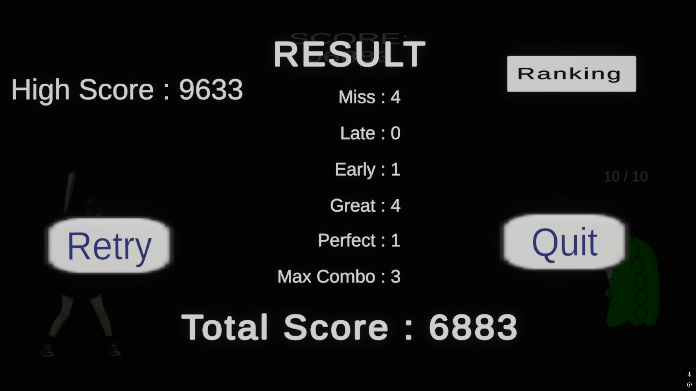

# Perfect Hit（プロトタイプ版）

## 🎮 概要
Unityで制作したカジュアルゲームです。  
タイミングに合わせて操作し、スコアを獲得していくシンプルなゲームデザインになっています。

- ジャンル：2Dカジュアルゲーム
- 制作環境：Unity
- 使用言語：C#
- 制作期間：約半月

---

## 🔗 プレイURL
- https://toro854.itch.io/perfect-hit

※ブラウザでプレイ可能

---

## 🎮 操作方法
- クリック / スペースキー：アクション実行（※実際の操作に合わせて修正）
- ルール：
  タイミングよく入力することでスコアが加算される
- ゲームオーバー条件：
  10球投げ終わったら終了。

---

## 🧑‍💻 担当範囲
- ゲーム企画
- ゲームシステム設計・実装（Unity / C#）
- UI実装
- ゲーム進行管理など全部

---

## 🛠 使用技術
- Unity
- C#
- Git / GitHub

---

## ✨ 工夫した点
- 画面クリックやタップのみの操作
- タイミング判定の気持ちよさを重視し、入力の許容範囲を調整
- スコア獲得時のフィードバック演出を強化
- 短時間でも遊べるゲームループ設計

---

## ⚠️ 苦労した点
- AIで作れない部分のドット修正
- タイミング判定のズレを改善するための調整
- ゲームテンポと難易度のバランス調整
- UIとゲーム進行の同期処理

---

## 📷 スクリーンショット
- タイトル画面

- ゲームプレイ画面

- カットイン表示画面

- リザルト画面

---

## 📌 備考
今後の改善予定：
- 演出の強化
- ステージ追加
- サウンド調整
